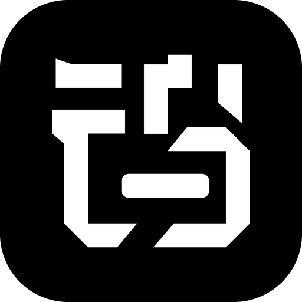
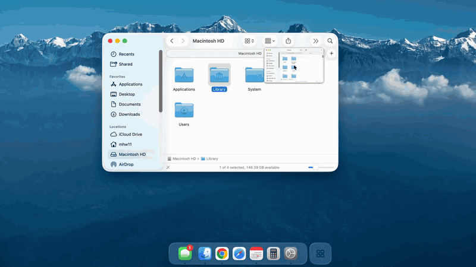

<div align="center">



# Tungsten Edge

**A per-window taskbar for macOS — switch to any window in one click, Windows-style clarity without the clutter.**

English · [中文](README.zh-CN.md)

### [⬇ Download for macOS](https://tungstenedge.app)

Ready-to-run builds live on the [official website](https://tungstenedge.app). This repository holds the source.

</div>

---

## Demo



---

## What it is

Open enough windows and every Mac user hits the same thing: getting back to *that one window* takes a search. Click a Dock icon and every window leaps out at once; the right-click list means open, find, pick — every time, in an order that keeps shifting. Anyone who has used Windows knows this could be a glance and a click.

Apple knows too: Mission Control and Stage Manager are their answers — but they tidy your desktop, not your switching. Tungsten Edge takes a different route: it brings "every window one click away" to the bottom of your Mac.

- **Organized by window**: every window gets its own card on the taskbar — one click and you're there; single-window apps stay collapsed as compact icons, so the bar stays lean; a minimized window's card waits right where it was.
- **Switching done right**: clicks do the right thing — wake what should wake, minimize what should minimize; cards don't jump around, flicker, or linger as ghosts. Anyone who has tried similar tools knows none of this comes for free — window identification is where most of Tungsten Edge's engineering lives.
- **Native and light**: built in native Swift, not a web wrapper; frosted glass that blends into the desktop; animations and dragging stay glued to your pointer; designed to sit quietly at the bottom edge all day.

The drawer, unread badges for messaging apps, pinned folders, a taskbar on every display, blink-free full screen — all there; see the features below.

## Features

- **Window-level taskbar** — one card per window; multi-window apps split into multiple cards; click to switch / minimize.
- **Card states you can read at a glance** — a greyed-out title means that window is not on the desktop right now (minimized, or its whole app is hidden); click the card and it comes back. Windows on other desktops (Spaces) are **not** greyed: they stay listed on the taskbar, and clicking one switches you to that desktop.
- **Smart native-tab merging** — apps where "tabs are windows" (Ghostty, Finder) keep a stable card while you switch tabs: it won't jump around or split.
- **App drawer** — stash rarely-used apps into a drawer on the right to keep the strip clean; pin favorites in the drawer to use it as a launcher.
- **Drag to organize** — reorder cards by dragging; drag a card into the drawer to stash it; drag it back out and it lands exactly where you drop it.
- **Menu bar and Settings** — the status menu holds Open at Login, the wake delays for the Dock and for Tungsten Edge, and the handful of appearance preferences you reach for while tuning the bar (which screen it shows on, taskbar size, Show Shelf, hover names, maximized-window avoidance); language, shortcuts, feedback, licensing and update checking live in the settings window.
- **Edge auto-hide** — Tungsten Edge is **always visible by default**; it can also hide itself and wake from the bottom edge after the delay you choose, hiding again about 0.2s after you move away. The tier lives on the Tungsten Edge slider in the status menu, and `⌥⇧⌘D` toggles between always-visible and your last auto-hide delay.
- **Frosted-glass look** — native-grade translucency that blends into the desktop.
- **Multi-display** — one taskbar that follows your pointer between screens, or **one taskbar per display**. With one per display, each bar can list **only the windows sitting on that display**; drag a window card from one display's bar onto another's and the window moves across with it, without being forced to the front.
- **Blink-free native full-screen entry** — before a standard green-button or `Control-Command-F` full-screen transition, Tungsten Edge moves its panels out of the transition snapshot. This is enabled by default and can be turned off in Settings.

> **Note:** the interface ships in **ten languages** — English, 简体中文, 繁體中文, 日本語, Deutsch, Français, Español, Português, Italiano and 한국어 (Spanish and Portuguese each in two regional variants) — and follows your system language. To pick one explicitly, use **Settings ▸ General ▸ Language** in Tungsten Edge.

## Requirements

- macOS 12.0 (Monterey) or later
- Intel and Apple Silicon (universal binary)
- On first launch you'll be asked to grant **Accessibility** permission (used to read and manage windows; the app guides you through it).

### Global input observation

Entering a native full-screen Space lets the system's transition snapshot catch the taskbar, which shows up as a one-frame blink. Removing it requires hiding the taskbar *before* your input reaches the target app, so Tungsten Edge observes global **left-click, key-down and trackpad gesture** events. It recognizes only these four:

- the standard window green button
- the exact `Control-Command-F` shortcut
- `Control-Left` / `Control-Right` (when switching into an adjacent full-screen Space)
- a three-finger horizontal swipe (same case)

Ordinary input is not recorded, logged, modified, or sent anywhere. The listener is enabled by default; turn off **Predict full-screen transitions to prevent taskbar flicker** under **Advanced** in Settings to disable it completely.

Separately, when **Reverse mouse scroll direction** (Settings › General, off by default) is on, a second event tap watches scroll-wheel events and inverts the direction values of discrete mouse-wheel ones — that inversion is the whole feature; trackpad and Magic Mouse events pass through untouched, and nothing is recorded or sent anywhere. The tap exists only while the switch is on. Kill switch for diagnostics: launch with `DOCK_SCROLL_REVERSER=0`.

macOS suppresses key events from global event taps while Secure Input is active, such as in a protected password field. During that time the keyboard shortcuts cannot be recognized in advance; green-button and trackpad-gesture detection are unaffected.

## Install

### Option 1 — download the installer (recommended)

1. Download the latest `.dmg` from the [official website](https://tungstenedge.app).
2. Open it and drag **Tungsten Edge** into your **Applications** folder.
3. Double-click to open it. On first run, grant **Accessibility** permission when prompted (see [Grant Accessibility permission](#grant-accessibility-permission) below).

### Option 2 — Homebrew (for technical users)

```bash
brew install --cask tungsten-edge
```

> Tungsten Edge is in the official Homebrew cask registry. The older command
> `brew install --cask moonbai-studio/tungsten-edge/tungsten-edge` still works and installs the same official cask.

## Grant Accessibility permission

As of **v0.9.0 Tungsten Edge is signed and notarized by Apple**, so it opens with a plain
double-click — no right-click workaround needed.

One step remains: Tungsten Edge needs **Accessibility** permission to read and manage your
windows, and it guides you through this on first run:

- Open **System Settings → Privacy & Security → Accessibility**, find **Tungsten Edge**, and **turn on its switch**.

> **Upgrading from v0.8.0 or earlier:** v0.9.0 switched to a proper Developer ID signature, so
> macOS treats it as a *different* app and your old Accessibility grant no longer applies.
> **Quit Tungsten Edge**, select the old **Tungsten Edge** entry in the Accessibility list and
> remove it with the **−** button, then reopen Tungsten Edge and grant it again. One time only;
> future updates will not need this.

## Status menu and Settings

Preferences live in two places, and the split is deliberate: the **status menu** carries only what you flip mid-session, the **settings window** carries everything else.

### Status menu

- **Open at Login** — the first menu item. On macOS 13 and later this goes through the system's Login Items; if macOS asks for approval, open Login Items in System Settings and approve Tungsten Edge there. On macOS 12 it is written to System Preferences → Users & Groups → Login Items, where you can also see and remove it.
- **Tungsten Edge (⌥⇧⌘D to show/hide)** — a greyed-out section header, not a clickable command. Below it sits a compact slider for the taskbar's own wake delay: `Always Visible`, `0.1s`–`3.0s`, or `Never Wake`. The global `⌥⇧⌘D` shortcut switches between always-visible and your last auto-hide delay; it is the Dock's `⌥⌘D` plus Shift, which also releases the older `⌥⌘E` back to Safari and Finder. You can record a different combination in Settings → General. If the shortcut cannot be registered, the menu simply stops showing the key hint.
- **The Dock (⌥⌘D to show/hide)** — likewise a section header. `⌥⌘D` belongs to macOS, so it is named here as plain text rather than claimed as a shortcut. Its slider sets the **Dock's** wake delay (`Always Visible`, `0.1s`–`3.0s`, `Never Wake` — drag to `Never Wake` and the Dock stops popping up at the screen edge entirely). Moving it stages a draft and reveals a confirm row; nothing is written until you press it, because every write restarts the Dock and flashes the screen.
- **Single/Multi-Display Mode ▸** — appears only with two or more displays, and holds two groups. **Single-display mode**: the default is **Follows the pointer** — rest the pointer at another screen's bottom edge and the bar moves there; or choose **Pinned to** a named screen, after which resting at another screen's bottom edge no longer moves it; unplug the pinned screen and the bar falls back to the main display, returning when you plug it back in. **Multi-display mode**: every display gets its own bar — **Mirrored bars** all show the same content, while **Separate bar per display** narrows each bar to the windows sitting on that display (it filters by *display*, not by desktop — windows on your other Spaces are still listed). On a fresh install, the first time you connect a second display it switches to **Multi-display mode / Separate bar per display** on its own — once only, and you can change it back here at any time. Upgrades keep whatever you already had.
- **Taskbar Size** — a slider in the menu. You can also drag the bar itself, like the real Dock's divider: press on the gap beside a zone divider and drag up or down — or, on a bar with no divider, on either end (the pointer turns into the up-down resize cursor there). The bar and its capsule scale together — icons, labels, spacing, corner radius and bar height all follow — continuously between 32 and 120 pt; 54 pt matches the real Dock. An open drawer closes first so it can be re-measured. The drawer's own contents and the folder / shelf popups keep their current size.
- **Show Shelf** — shows or hides the shelf chip. Unchecking it only hides the chip; stashed file references are kept and come back when you check it again. Note that with the shelf hidden *and* no pinned folders, the whole folder zone disappears, so the taskbar has no external-file drop target and no **Add Folder…** entry — check it back on to get them.
- **Show app name on hover** — **off by default**. Turn it on and moving the pointer across the taskbar pops up app names; with it off you get a slight lift instead.
- **Keep maximized windows above the taskbar** — lifts the bottom edge of a screen-filling window above the taskbar, so the always-visible bar does not cover it. **On by default for a fresh install**; upgrades keep it off, because it resizes other apps' windows and should not switch itself on across an update — tick it here to get it. Three conditions have to hold together: the taskbar set to Always Visible (any auto-hide delay turns avoidance off), the bar actually on screen, and a window that really fills the available desktop area (dragging one to roughly that size does not count).
- **Dock Settings…** — opens Desktop & Dock on Ventura and later, or Dock & Menu Bar on macOS 12. It only opens System Settings; it never writes Dock preferences or restarts Dock.
- **Settings…** — opens the settings window described below.
- **Install x.y.z…** — appears only while an update is waiting to be installed, marked with a small red dot (the menu-bar icon carries a dot too). One click downloads, installs and relaunches. Manual checking lives in the settings window's About section.

### Settings window

Open it from **Settings…** in the status menu, or by **right-clicking the drawer capsule** at the right end of the taskbar. The window is organized as five toolbar tabs — General, Advanced, License, Feedback, About — and its title follows the selected tab. (`⌘,` does not work in normal operation: Tungsten Edge runs as a menu-bar app and has no menu bar of its own to hang it on.)

- **General**
  - **Language** — any of the ten interface languages (Spanish and Portuguese each offer two regional variants). **Until you pick one, Tungsten Edge follows the system language** (English when the system language is not one of them); the picker shows whichever is currently in effect. Picking one fixes it, and it no longer follows the system afterwards (to go back to automatic on macOS 13 and later, set Tungsten Edge back to Automatic in System Settings → General → Language & Region → Applications). Uses the same per-app language mechanism as macOS 13+'s Language & Region, and brings it to macOS 12; takes effect after a restart (the prompt offers one-click relaunch).
  - **Appearance** — three cards: **System** (follows macOS light / dark), **Light**, **Dark**. Applies to the taskbar, drawer, popups and the settings window at once.
  - **Show/hide taskbar shortcut** — click the recorder, press a new combination, done (default `⌥⇧⌘D`; *Reset to Default* brings it back). Combinations that would clash with macOS — `⌥⌘D`, Option-only, Control-Option without Command — are rejected with an explanation, and if another app already owns the combination the previous shortcut stays active.
  - **Reverse mouse scroll direction** — off by default. Flips mouse-wheel scrolling system-wide, like Scroll Reverser, so the wheel can scroll Windows-style while the trackpad keeps macOS natural scrolling. Trackpads and Magic Mouse are not affected. If Scroll Reverser or Mos is also running, the two cancel out — keep only one. See [Global input observation](#global-input-observation) for what this touches.
  - **Show Setup Guide Again** — reopens the first-run guide with its three recommended Dock settings (hide the Dock, use the scale minimize effect, minimize windows into the app icon). The guide only appears by itself once, so this button is the way back to it.
- **Feedback** — pick a type (Bug Report / Feature Suggestion / Other) and the box offers a matching hint; write your message, attach up to 3 screenshots or screen recordings (10 MB per image, 30 MB per video, 40 MB in total), optionally leave a contact and hit Send — only your message, the attachments you add, the contact you enter, the app version, your macOS version and the interface language are transmitted. Attachments are stored in a private bucket and deleted automatically after at most 90 days.
- **License** — licensing opens with version 1.0; until then Tungsten Edge is completely free. This tab also carries the **founding-user mailing list**: leave your email address and the permanent free license key will be sent straight to you when 1.0 arrives.
- **Advanced** — **Predict full-screen transitions to prevent taskbar flicker** (on by default; see [Global input observation](#global-input-observation) for exactly what it watches).
- **About** — version, **Check for Updates…** (when an update is available you get an update window: one click downloads, installs and relaunches — no more downloading a disk image and dragging it across by hand), **Check for updates automatically** (on by default; turn it off and Tungsten Edge stops contacting the network on a schedule, checking only when you click *Check for Updates…*).

Writing Dock preferences requires a non-sandboxed build, because sandboxed apps cannot write Dock preferences or restart Dock. Opening the settings pane works in either environment.

## Recommended setup (align the minimize animation to the bottom)

> On first run, if the Dock is not already set to hide itself, Tungsten Edge offers three
> checkboxes — hide the Dock, use the scale minimize effect, and minimize windows into their app
> icon — all ticked, applied in one click. You will not see that prompt if you have already hidden
> the Dock; the rest of this section is the manual route.


If your Dock lives on the **side or top** of the screen, minimizing a window flies the animation toward the Dock — out of sync with this bottom taskbar. Move the Dock back to the **bottom** and set it to auto-hide; the minimize animation will then shrink toward the bottom, matching Tungsten Edge:

- **System Settings → Desktop & Dock → Position on screen → Bottom**, and turn on **Automatically hide and show the Dock**.

To keep the Dock from ever reappearing, drag the Dock slider in the status menu to `Never Wake`: hovering at the screen edge will no longer wake it.

Two more settings under **System Settings → Desktop & Dock** pair well with a bottom taskbar:

- **Minimize windows using → Scale effect.** The genie effect sweeps the window all the way down across Tungsten Edge; scaling is quicker and stays out of the way.
- **Minimize windows into application icon → on.** Minimized windows still show as chips on Tungsten Edge, so there is no need for a second copy at the right end of the Dock.

## Status

- Current version: see [Releases](https://github.com/moonbai-studio/tungsten-edge/releases) — signed and notarized by Apple since v0.9.0.
- The interface ships in ten languages (see the note under Features) and follows your system language; a Chinese version of this README is at [README.zh-CN.md](README.zh-CN.md).
- Feedback and issues are very welcome.

## Community

**Issues vs Discussions** — [Issues](https://github.com/moonbai-studio/tungsten-edge/issues) are for bug reports and concrete feature requests. For questions about how to use Tungsten Edge, installation help or general discussion, please use [Discussions](https://github.com/moonbai-studio/tungsten-edge/discussions).

Issues and discussions are answered in English and Chinese alike — write in whichever you prefer.

**Discord** — [Join the server](https://discord.gg/QnKjUMVzdC) for announcements and support in English (Chinese is welcome too).

**WeChat Group** *(for Chinese-speaking users)*


The QR code is updated weekly. If it has expired, please leave a message in [Issues](https://github.com/moonbai-studio/tungsten-edge/issues) and I'll renew it promptly.

Tungsten Edge recognizes and thanks the [LINUX DO](https://linux.do/) community for providing a place for discussion and feedback.

If Tungsten Edge is useful to you, a GitHub star still helps. Thanks to everyone who already starred: your stars got Tungsten Edge into the official Homebrew cask registry, so it now installs with `brew install --cask tungsten-edge`, no repository name to type.

## Pricing

Free today. From 1.0, Tungsten Edge is a one-time purchase — no subscription. Everyone who confirms their email on the founding-user list before then keeps it free forever.

## License

Copyright (C) 2026 Moonbai Studio.

Tungsten Edge is licensed under the GNU General Public License v3.0 or later (`GPL-3.0-or-later`). See [LICENSE](LICENSE).

The application source code, build scripts, and assets required to build it are published in this repository. Code-signing certificates, notarization credentials, account credentials, and other secrets are not source code and are never included.

The license covers the source code; it does not require official signed/notarized binaries or related services to be provided free of charge.

The names "Tungsten Edge" and "钨极" and the logo are trademarks and are not covered by the GPL. Forks and self-built binaries must use a different name and icon — see [TRADEMARK.md](TRADEMARK.md).

---

## Developers

Release notes for every version are archived under [`Docs/Archive/Releases/`](Docs/Archive/Releases).

**Build & run** (kills any running instance, builds Debug, re-signs, launches — never run a bare `xcodebuild` + `open`, the app's Accessibility grant follows the signing identity):

```bash
./Scripts/build_and_run.sh          # dev loop
./Scripts/build_and_run.sh --lab    # window-lab diagnostic CLI
```

**Tests** (1,300 XCTest cases, ~40 s; the same command CI runs on every push):

```bash
xcodebuild test -project macos-dock-cc-v2.xcodeproj -scheme macos-dock-cc-v2 \
  -derivedDataPath build/DerivedData -destination 'platform=macOS' CODE_SIGNING_ALLOWED=NO
python3 Scripts/check_localization.py     # every String(localized:) has a zh-Hans entry
python3 Scripts/check_debug_switches.py   # every DOCK_* env switch is registered
```

**How the code is laid out** — one Xcode target, four folders that only point downward:

| Folder | What lives there | Rule of thumb |
|---|---|---|
| `Core/` | Pure decisions: identity rules, placement, lifecycle planning, ~50 small `…Decision` / `…Plan` / `…Policy` types in `Core/Support` | No AppKit, no AX. If a behaviour can be expressed as a pure function of facts, it goes here and gets a unit test. |
| `Platform/` | The system adapters: Accessibility (`AXWindowReader`, `AccessibilitySource`), CoreGraphics window lists, the fullscreen / Spaces event taps, Finder | Talks to macOS, hands facts up to Core. `AppTracker` here is the single window-inventory authority. |
| `App/` | Composition and UI: `AppDelegate` wires the object graph, `PanelCoordinator` owns the five `NSPanel`s, `DockStripView` renders the strip, the `…Store` classes persist user choices in `UserDefaults` | Big types are split by responsibility into `Type+Topic.swift` extension files. |
| `Tools/WindowLab/` | A replay CLI for window-identity scenarios; the old observation pipeline lives only here | Not part of the shipping app. |

Two habits keep it maintainable: decision logic is extracted into `Core/Support` *before* it is wired into a view or controller (that is why the test suite is large without a UI harness), and every `DOCK_*` environment switch is declared in `Core/Support/DebugSwitch.swift` with its polarity and purpose.

**Signing.** The Xcode project signs with a local certificate on purpose; the real Developer ID signature, hardened runtime, notarization and packaging happen in `Scripts/package_release.sh` (fail-closed: it will not produce `dist/` unless every check passes). `Scripts/install_local_release.sh` installs the same signed build into `/Applications` for daily use.

**Contributing.** Open an issue first for anything beyond a small fix — the bug template asks for the details that make window-identification problems reproducible. English is the source language and the UI ships in twelve localizations; a new user-facing string needs a value in every one of them (`Scripts/check_localization.py` fails otherwise).

**A note on the source comments.** They are written in Chinese. Everything facing a user or a reporter — the UI strings, this README, the release notes, the issue templates — is bilingual, but the in-code rationale is not, and it is where most of the *why* lives. If a specific area blocks you, open an issue naming the files and I'll translate that part.
