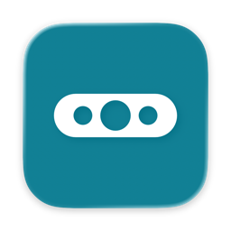
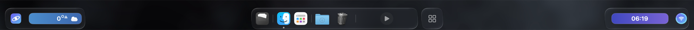
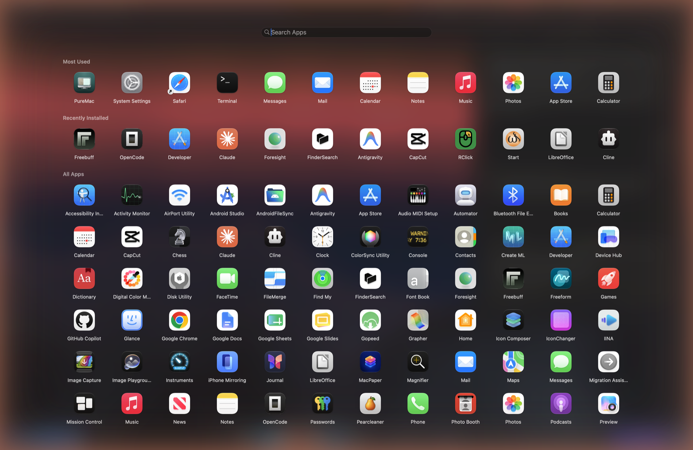
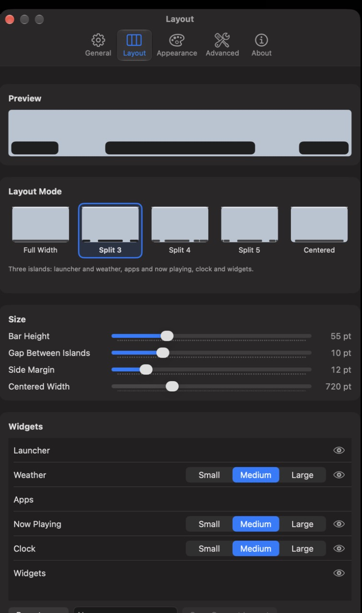

<div align="center">



# KatiKati

**A per-window taskbar for macOS, with an app launcher, widgets and quick settings.**

*katikati* is Swahili for "right in the middle".

English · [中文](README.zh-CN.md)

[Download the beta](https://github.com/wakilibaraka/KatiKati/releases/latest) · [Report a problem](https://github.com/wakilibaraka/KatiKati/issues/new/choose) · [Changelog](CHANGELOG.md)

</div>

---



> **Beta.** Version 0.17.0 beta 3 is unsigned and not notarized. See [Install](#install). Several new screens were not yet exercised on a real
> trackpad or across displays, and all new translations are drafts awaiting review. Expect rough edges.

## What it is

KatiKati puts a floating bar at the bottom of your Mac. Each window gets its own card, so getting back to *that one window* is a glance and a
click instead of a search. Around the bar it adds a launcher, a page of live widgets and a set of quick switches, all in native Swift.

KatiKati is a fork of [Tungsten Edge](https://github.com/moonbai-studio/tungsten-edge) and keeps its window-tracking core; see [Credits](#credits).

## Features

### Taskbar

- **One card per window.** Multi-window apps split into several cards; single-window apps stay compact. Click to switch, minimize or restore.
- **Cards you can read at a glance.** A greyed title means the window is minimized or its app is hidden; windows on other Spaces stay listed and
  clicking one takes you there.
- **Five layouts.** Full Width, Split 3, Split 4, Split 5 and Centered, with adjustable bar height, gaps, margins and widget widths
  (Settings > Layout).
- **Island widgets on the bar.** Weather, Now Playing and a clock; the clock opens a calendar panel and the weather chip opens a forecast panel.
  Weather asks for Location Services (or use a city you search for) and keeps the last forecast for each place for up to seven days, so it still
  shows when you are offline.
- **Starter apps.** A fresh install keeps Finder, Safari, System Settings and Messages on the bar so it is never empty.
- **App drawer, shelf, trash and pinned folders.** Drag cards to reorder them, stash apps in the drawer, drop files on the shelf.
- **Edge decks.** Slim decks on the left and right screen edges hold Notes (encrypted at rest), Reminders, Alarms, Timer and Stopwatch, Tasks,
  Clipboard history (opt-in), Capture (text and QR codes from a screen area), Windows (snap into zones), Screen Time, Weather, Now Playing,
  Bluetooth and a system monitor.
- **Multi-display.** One bar that follows your pointer, or one bar per display, each listing only its own windows.
- **Auto-hide.** Always visible by default; it can also hide and wake from the bottom edge. `⌥⇧⌘D` toggles it.
- **Blink-free full screen.** The bar steps out of the way before a native full-screen transition (see [Privacy](#privacy)).

### Notch

On Macs with a camera housing, and as a floating island elsewhere, the notch grows into a page deck: Downloads, music and calendar, Storage
(the largest folders and files, biggest first), productivity, camera mirror and notifications. Closed, it shows free storage on the left and the
battery on the right; events appear as toast cards. Settings > Notch has the style, page order and **Sharp Notch Edges**.

### Launcher



- **One app grid, 8 icons across.** A **Most Used** row first (the apps you actually launch; until you have enough history, System Settings, Safari, Terminal,
  Messages, Finder, Mail and Calendar fill the gaps), then **Recently Installed**, then **All Apps**. Search sits at the top, or on any side.
- **Sliding pages.** Swipe, scroll, press the arrow keys or click the dots to move between pages; or switch to a single page that scrolls down
  (Settings > Layout > Launcher).
- **Make it yours.** Drag apps in All Apps to reorder them. Right-click an app to open it, show it in Finder, copy its path, pin it, move it to the
  start or hide it from the launcher (hidden apps are still found by search). Settings shows how many are hidden and can show them all again or reset the order.
- **Open it your way.** The left button on the bar, `⌥Space`, or a four-finger pinch on the trackpad (off by default; see [Shortcuts](#shortcuts-and-gestures)).
- **Themes.** System, Light, Dark, Glass or your desktop picture, with an optional colour tint and three icon styles.

### Control Center

The Control Center is a side panel (left or right, your choice in Settings), opened from the button at the right end of the bar or with `⌃⌥Space`.
It holds the Quick Settings switches, your widgets, and the connectivity controls.

- **Widgets:** Calculator, Screen Time (opt-in), Network, Battery with
  health and cycles, Top Apps, Batteries (your Mac and connected Bluetooth devices). The same tiles also live in the widget pane.
- **Quick Settings** has 18 switches: Dark Mode, Keep Awake, Hide Desktop, Hidden Files, Dock Auto-hide, Path Bar, Mute Mic, Empty Trash (asks first),
  Eject Disks, Wi-Fi, Bluetooth, Night Shift, True Tone, VPN, Screen Saver, Lock Screen (asks first), Relaunch Finder (asks first) and Screen Mirroring
  (opens Display Settings). Bluetooth, Night Shift and True Tone rely on system interfaces that macOS does not document, so they can stop
  working after a macOS update; they fail quietly. VPN covers Network-configured VPN services only.
- iPad, Apple Watch and iPhone batteries are not shown: macOS does not expose them to a Mac.

### Shortcuts and gestures

| Action | Default | Alternatives |
|---|---|---|
| Open the launcher | `⌥Space` | `⌃Space`, `⌥⇧Space`, `⌃⇧Space`, `⌃⌥Space`, or double-tap `⌘`, `⌃` or `⌥` |
| Open the Control Center | `⌃⌥Space` | same list |
| Quick Settings only | off | same list |
| Keep Awake on/off | off | same list (shows a short toast) |
| Show or hide the bar | `⌥⇧⌘D` | rebind in Settings > General |
| Launcher by pinch | off | four or more fingers pinched together on the trackpad |

Double-tap shortcuts need Accessibility. The pinch gesture reads raw trackpad touches through an undocumented macOS interface and needs no
permission. macOS has its own four-finger pinch (Launchpad) that opens the system app list, so turn **Launchpad** off under System Settings >
Trackpad > More Gestures before using it. `⌃Space` may also clash with the macOS input-source shortcut.

### Works without Accessibility

KatiKati starts even before you grant Accessibility. In this *limited mode* the bar, edge decks, launcher, Control Center and shortcuts work; what needs
Accessibility is reading and managing other apps' windows (the per-window cards). The status menu shows **Grant Accessibility for Full
Functionality...**; when you grant it, KatiKati relaunches itself into full mode.

### Languages

The interface follows your system language in 12 localizations: English, 简体中文, 繁體中文, 日本語, Deutsch, Français, Español (Spain and Latin
America), Português (Brazil and Portugal), Italiano and 한국어. Change it in Settings > General > Language.

## Install

Requirements: macOS 15 (Sequoia) or later, Intel or Apple Silicon (universal binary).

1. Download `KatiKati-0.17.0-beta.3.dmg` from the [latest release](https://github.com/wakilibaraka/KatiKati/releases/latest).
2. Open the disk image and drag **KatiKati** to **Applications**.
3. The beta is not notarized, so on first launch **right-click KatiKati and choose Open**, then confirm.
4. Optional: grant **Accessibility** (System Settings > Privacy & Security > Accessibility) for the per-window cards. Each new unsigned build may need
   the permission granted again.

The in-app update feed is live but has no releases in it yet, so betas are distributed through the Releases page: download new versions from there.

To build from source instead, see [Developers](#developers).

## Recommended Dock setup

KatiKati is designed to replace the Dock at the bottom of the screen. On first run it offers three checkboxes, applied in one click: hide the Dock,
use the scale minimize effect, and minimize windows into their app icon. To do it by hand, open System Settings > Desktop & Dock and:

- set **Position on screen** to **Bottom** and turn on **Automatically hide and show the Dock** (otherwise the minimize animation flies toward a side
  or top Dock);
- set **Minimize windows using** to **Scale effect**;
- turn on **Minimize windows into application icon**.

To stop the Dock reappearing at all, drag **The Dock** slider in the KatiKati status menu to `Never Wake`.

## Status menu and Settings

The **status menu** (the capsule icon in the menu bar) holds what you change mid-session: Open at Login, the bar's wake delay, the Dock's wake delay,
Taskbar Size, a Layout submenu, Show Shelf, Show Trash, Show app name on hover, Keep maximized windows above the taskbar, Dock Settings and Settings.
With two or more displays it also offers single- and multi-display modes.

The **Settings window** has a sidebar (search with `⌘F`, sections with `⌘1`...`⌘9`) and a live preview stage on most pages. Its original tabs are:



- **General:** language, appearance (System, Light, Dark), the show/hide shortcut, widget layout and colours, clock style, units, weather options,
  Now Playing theme, drawer position, reverse mouse scroll direction, and the setup guide.
- **Layout:** layout mode and sizes, bottom edge, **Widgets** (reorder, hide, Small/Medium/Large, presets, Smart Stack, schedule-based presets; right-click any widget on the bar for the same controls and *Edit Widgets*), edge decks, and the Launcher, Control Center and Shortcuts sections.
- **Appearance:** the bar's theme (Auto, Translucent, Crystal Clear, Obsidian Dark, Aurora Glow, Deep Ocean and more), icon set, custom tint and opacity, and an optional **Dynamic Wallpaper** that follows the sun and the weather (it saves your wallpaper first and puts it back when you turn it off or quit).
- **Advanced:** predicting full-screen transitions.
- **About:** version, check for updates, and **Diagnostic Info** (copies app, system and display details to paste into a GitHub issue).

## Privacy

KatiKati has no account, no analytics and no feedback form. It does not send your data anywhere. Things that touch the network or system:

- **Update check.** Sparkle checks an update feed on a schedule (you can turn it off in Settings > About). The feed is hosted on GitHub Pages and has no
  releases in it yet, so the check currently finds nothing.
- **Weather.** The weather chip and card request a forecast for your location (if you allow it) or a city you search for.
- **Input observation, for blink-free full screen.** To hide the bar *before* a native full-screen transition, KatiKati observes global left-click,
  key-down and trackpad-gesture events and recognizes only four things: the window's green button, `Control-Command-F`, `Control-Left`/`Control-Right`
  into an adjacent full-screen Space, and a three-finger horizontal swipe. Other input is not recorded, logged or sent anywhere. Turn off **Predict
  full-screen transitions** under Settings > Advanced to disable the listener entirely.
- **Reverse mouse scroll direction** (off by default) adds a second event tap that only flips the direction of discrete mouse-wheel events, and only
  while the switch is on.
- **Screen Time** (off by default) records only which regular app is frontmost and for how long, on this Mac, with 90-day retention; it never records
  window titles, documents, keystrokes or screenshots. "Delete Screen Time Data" wipes it.
- **Bluetooth.** The Bluetooth switch asks macOS for Bluetooth access the first time it needs to read the power state.

macOS suppresses key events from event taps while Secure Input is active (for example in a password field), so the full-screen prediction shortcuts are not
recognized then; the green-button and gesture checks are unaffected.

## Credits

KatiKati is built on [Tungsten Edge](https://github.com/moonbai-studio/tungsten-edge) by Moonbai Studio (GPL-3.0-or-later): the window-tracking
engine, strip rendering, panel coordination and baseline test suite. It also uses ideas and code from SplitBar-old and DockBar (both MIT) and studies
[noty](https://github.com/aimen08/noty) and EdgeDeckBar. Full notices are in [NOTICE](NOTICE).

## License

KatiKati is licensed under the GNU General Public License v3.0 or later (`GPL-3.0-or-later`). See [LICENSE](LICENSE) and [NOTICE](NOTICE).
The names "Tungsten Edge" and "钨极" and their logo belong to Moonbai Studio and are not used here; see [TRADEMARK.md](TRADEMARK.md).
Code-signing certificates, notarization credentials and other secrets are never part of this repository.

---

## Developers

Release notes for each version are kept under [`Docs/Releases/`](Docs/Releases); the running log of decisions and slices is [`HYBRID_PLAN.md`](HYBRID_PLAN.md),
and the working rules are in [`STANDING_RULES.md`](STANDING_RULES.md).

**Build and run** (kills any running instance, builds Debug, re-signs, launches; do not run a bare `xcodebuild` and `open`, because the Accessibility
grant follows the signing identity):

```bash
./Scripts/build_and_run.sh          # dev loop
./Scripts/build_and_run.sh --lab    # window-lab diagnostic CLI
```

**Tests** (about 1,900 XCTest cases; the same commands CI runs on every push):

```bash
xcodebuild test -project KatiKati.xcodeproj -scheme KatiKati \
  -derivedDataPath build/DerivedData -destination 'platform=macOS' CODE_SIGNING_ALLOWED=NO
python3 Scripts/check_localization.py     # every localized string has a value in all 12 languages
python3 Scripts/check_debug_switches.py   # every DOCK_* environment switch is registered
```

**How the code is laid out** (one Xcode target; four folders that only point downward):

| Folder | What lives there | Rule of thumb |
|---|---|---|
| `Core/` | Pure decisions: window identity, placement, layout packing, shortcuts, launcher ordering, pinch detection | No AppKit, no Accessibility. If behaviour can be a pure function of facts, it goes here with a unit test. |
| `Platform/` | System adapters: Accessibility, CoreGraphics window lists, event taps, the launcher indexer, system-health readers and the quick-toggle engine | Talks to macOS and hands facts up to Core. |
| `App/` | Composition and UI: `AppDelegate`, the panel controllers, SwiftUI scenes, and the `…Store` classes that persist settings in `UserDefaults` | Large types are split into `Type+Topic.swift` extensions. |
| `Tools/WindowLab/` | A replay CLI for window-identity scenarios | Not part of the shipping app. |

**Releases.** The Xcode project signs with a local certificate on purpose. Developer ID signing, notarization and packaging happen in
`Scripts/package_release.sh` on the maintainer's machine. Beta builds can be produced unsigned with a Release `xcodebuild` and `hdiutil`, as the
beta release did.

**Contributing.** Open an issue first for anything beyond a small fix. English is the source language; a new user-facing string needs a value in all 12
localizations (`Scripts/check_localization.py` fails otherwise). In-code comments are largely in Chinese, inherited from the upstream project; if a
specific area blocks you, open an issue naming the files.
